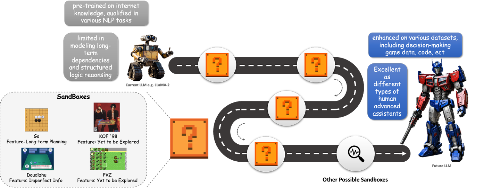
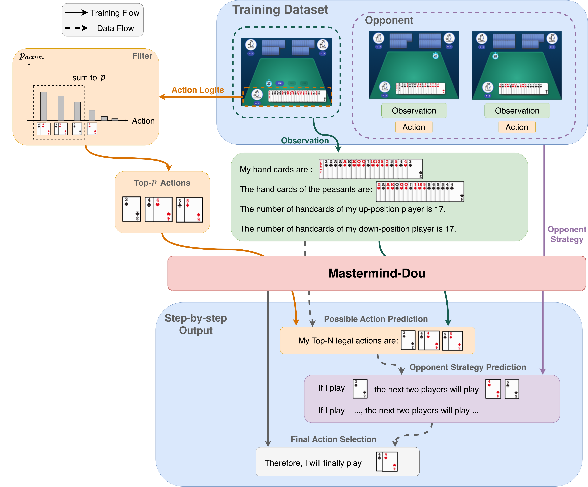
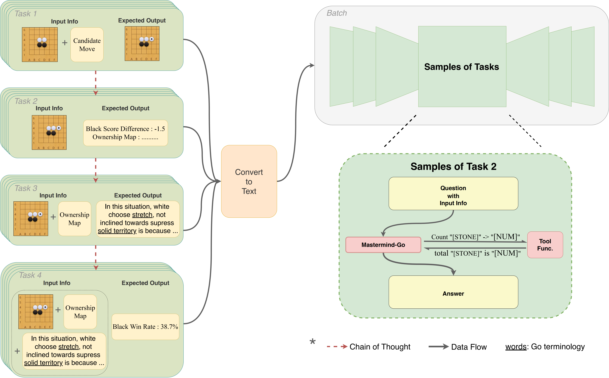
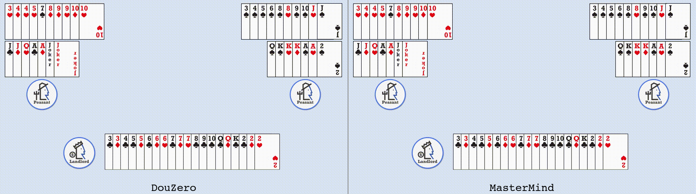
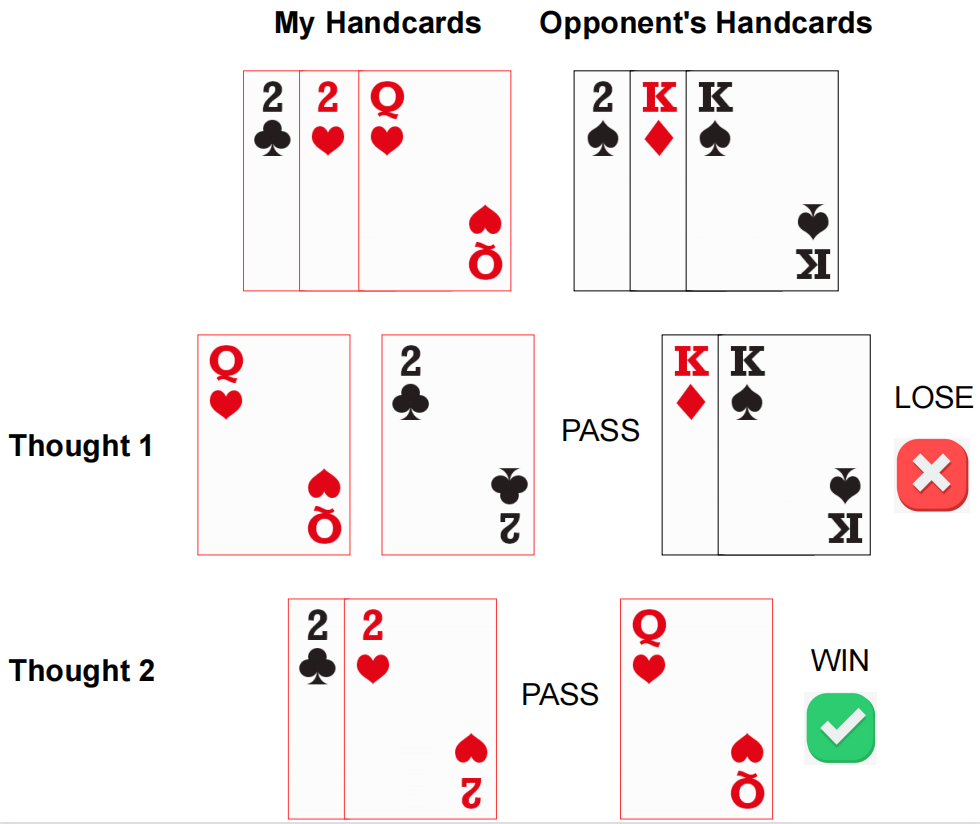
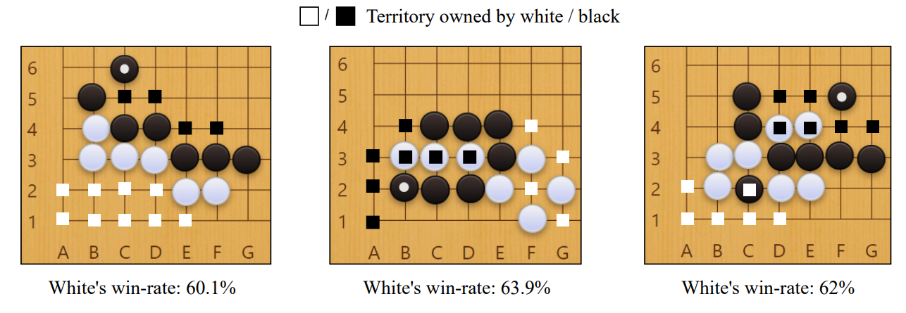
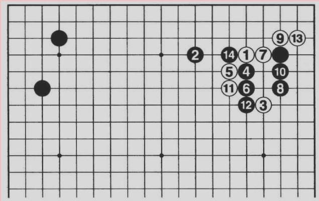

# MasterMind: Empowering LLMs in Decision Games through Algorithmic Data Synthesis
English | [简体中文(Simplified Chinese)](https://github.com/opendilab/Mastermind/blob/main/README.zh.md)

## Table of Contents
- [Dataset Description](#dataset-description)
  - [Dataset Summary](#dataset-summary)
  - [NEWS](#NEWS)
  - [Quick Start](#quick-start)
  - [Supported Tasks and Leaderboards](#supported-tasks-and-leaderboards)
  - [Languages](#languages)
- [Dataset Structure](#dataset-structure)
  - [Data Instances](#data-instances)
  - [Data Fields](#data-fields)
  - [Data Splits](#data-splits)
- [Dataset Creation](#dataset-creation)
  - [Curation Rationale](#curation-rationale)
  - [Source Data](#source-data)
  - [Annotations](#annotations)
- [Considerations for Using the Data](#considerations-for-using-the-data)
  - [Social Impact of Dataset](#social-impact-of-dataset)
  - [Other Known Limitations](#other-known-limitations)
- [Additional Information](#additional-information)
  - [Licensing Information](#licensing-information)
  - [Citation Information](#citation-information)


## News
- This dataset has been accepted by [ICLR2025 Workshop SynthData](https://openreview.net/forum?id=1RIHEJWN1L)
- [Paper Link](https://arxiv.org/abs/2503.13980)

## Dataset Description

### Dataset Summary

This dataset contains the expert dataset for the Doudizhu and Go tasks proposed in MasterMind. In summary, this dataset uses a QA format, with the question part providing the current state of the game; the answer part provides the corresponding game-playing strategy and the logic behind adopting this strategy. The dataset encodes all the above information in string format, all expert information is automatically generated by agents.
<br>
An example for how to use the Doudizhu part of this dataset to finetune your own LLM is [here](https://github.com/opendilab/Mastermind/blob/main/train_dou.py). 


### Quick Start

Here is a simple tutorial for applying instruct tuning on this dataset:

- Install torch==2.2.2. You can directly run the following command to install it with cuda==11.8. For other version, please view the official tutorial: [PyTorch](https://pytorch.org/)

```
pip install torch==2.2.2 --index-url https://download.pytorch.org/whl/cu118
```

- Install other requirements by:

```
pip3 install -r requirements.txt
```

- Run our demo code:

```
python trian_dou.py
```

### Supported Tasks and Leaderboards

#### Sub-dataset 1: Doudizhu
 <br>
This sub-dataset supports two tasks: `action_acc`, which corresponds to the proportion of actions chosen by the agent that are the same as the expert; and `thought_acc`, which corresponds to the proportion of the agent's thought process that matches the expert's. It should be noted that `action_acc` is relatively easier than `thought_acc`, as if the thought process is entirely correct, the final answer will also be correct. The leaderboards for these two tasks are listed below:

| Model            | thought acc | action acc |
| ---------------- | ----------- | ---------- |
| LLaMA-2-7B       | 0%          | 0%         |
| + MasterMind-Dou | 66%         | 95%        |
| Gemma-7B         | 0%          | 0%         |
| + MasterMind-Dou | 61%         | 91%        |

#### Sub-dataset 2: Go
 <br>
This sub-dataset supports four tasks: `s' ACC`, which is the prediction accuracy for next state given the current state and adopted action;  `expl. RLsum`, the RLsum for natural languange explanation given the current state; `Winrate MAE`, which is the mean absolute error of win-rate given the current state; and Score MAE, which is the mean absolute error of score difference given the current state. The leaderboards for these four tasks are listed below:

| Model           | s' Acc. | expl. RLsum | Winrate MAE | Score MAE |
| --------------- | ------- | ----------- | ----------- | --------- |
| LLaMA-2-7B      | 0%      | 11.45       | N/A         | N/A       |
| + MasterMind-Go | 99.44%  | 5.23        | 5.14        | 1.74      |

### Languages

This dataset is constructed entirely in English.

## Dataset Structure

### Data Instances

#### Doudizhu

Each entry in this dataset includes two parts: a "question" that encodes the current game states, and a "sentence" that provides analysis of the current situation and the final decision. A basic example for Doudizhu is as follows:



#### Go-task1

Since examples for go are not easy for visualization, we convert several samples into images. Here are some examples.

Task1: predict the next board state.


#### Go-task2

Task2: Predict analysis provided by katago.



#### Go-task3

Task3: Predict explanations about current game state.

**Board State:**



**Explanation:** When White 1 hangs high on the upper right, the preparations for Black 2's attack are taken into account beforehand. When White 3 comes over, Black 4's move to 12 is followed by White 13's move, and Black 14's break is related to the introduction.

### Data Fields

Each line of the dataset includes the following fields:

- question: The question asked to the LLM, mainly including the current game situation, possibly including extra information like legal actions and simple instructions for the LLM to complete the task.
- sentence: The standard answer dataset. It includes the final action taken and the thought process derived from this result.

### Data Splits

The dataset contains two general decision tasks: Doudizhu and Go.

- **Doudizhu:** This task contains a train split and a test split. During the dataset creation, we used a total of 500 complete games of Doudizhu. To ensure consistency with testing, we randomly selected 490 games for the training set and 10 games for the test set.
- **Go:** This dataset can be divided into three subsets. The first subset is used for predicting the next state, containing a total of 45,000 transitions for training and 5,000 transitions for testing; the second subset is used for situational analysis, containing a total of 12 games, with 10 games used as the training set and 2 games as the test set; the third subset is used for natural language interpretations of situations, with 450 entries for training and 51 entries for testing.

## Dataset Creation

### Curation Rationale

The curation of the MasterMind dataset was driven by the objective of advancing the capability of language models to understand and interact within the strategic context of various decision-making games. Recognizing the complexity of strategic decision-making in games that involve incomplete information, probabilistic outcomes, and competitive dynamics, this dataset specifically focuses on the interaction between expert-level play and language model training.

### Source Data

#### Initial Data Collection and Normalization

**Doudizhu:** In generating the dataset, we used DouZero as the expert agent and RLcard as the opposing agent. Specifically, we had DouZero play as the landlord against two RLcard agents as peasants, conducting many battles and collecting all intermediate states as the dataset. In the answer part, the generation rule for possible moves is a top-p filtering of the Q-values output by DouZero. The final action taken is the actual action used by DouZero.

**Go:** We used KataGo as the expert agent for data collection. The dataset for predicting the next state originates from the automatic judgments of the Go environment, the analysis of the environment is based on KataGo, and the textual commentary on the board states comes from the writings of Lee Sedol.

#### Who are the source language producers?

The strategy information in the dataset comes from the agent DouZero and KataGo, while the rest of the language template is provided by the authors of MasterMind. The textual explanations on the board states comes from the writings of Lee Sedol.

### Annotations

The dataset does not contain any manual annotation.

## Considerations for Using the Data

### Social Impact of Dataset

The core purpose of this dataset is to create a purely linguistic form of the decision-making game supervision dataset. By training language models on this dataset, we aim to achieve two goals: 1) enable language models to play various decision-making games; 2) enhance the general reasoning ability of language models through the logical reasoning process in the dataset. This dataset hopes to provide researchers with more considerations for enhancing the capabilities of language models from a data perspective.

### Other Known Limitations

- This dataset is only used for academic research.
- For any commercial use or other cooperation, please contact: [opendilab@pjlab.org.cn](mailto:opendilab@pjlab.org.cn)

## Additional Information 

### Licensing Information

This dataset is under [Apache License 2.0](https://www.apache.org/licenses/LICENSE-2.0).

### Citation Information

```
@misc{MasterMind,
    title={{MasterMind: OpenDILab} Empowering LLMs in Decision Games through Algorithmic Data Synthesis},
    author={Haolin Wang, Xueyan Li, Yazhe Niu, Shuai Hu, Hongsheng Li},
    publisher = {huggingface},
    howpublished = {\url{https://huggingface.co/datasets/OpenDILabCommunity/MasterMind}},
    year={2024},
}
```
