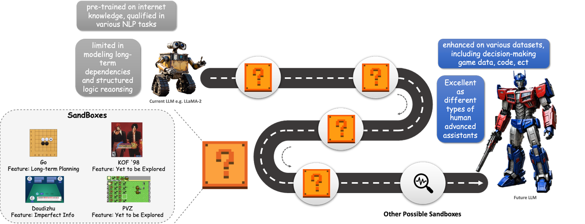
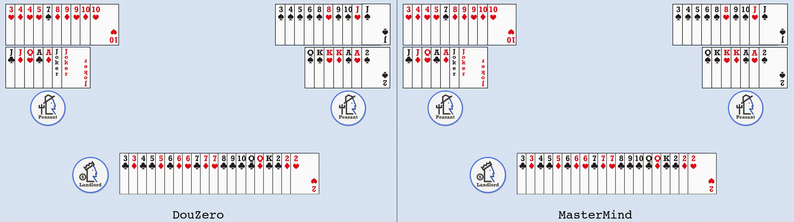
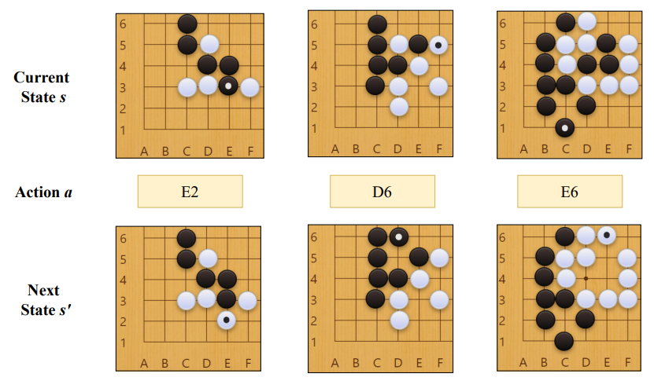

# MasterMind: Empowering LLMs in Decision Games through Algorithmic Data Synthesis
[English](https://github.com/opendilab/Mastermind/blob/main/README.md) | 简体中文(Simplified Chinese)

## 导航
- [数据集说明](#数据集说明)
  - [数据集简介](#数据集简介)
  - [NEWS](#NEWS)
  - [快速开始](#快速开始)
  - [支持的任务与排行榜概览](#支持的任务与排行榜概览)
  - [语言](#语言)
- [数据集结构](#数据集结构)
  - [数据示例](#数据示例)
  - [数据字段](#数据字段)
  - [数据划分](#数据划分)
- [数据集构建](#数据集构建)
  - [构建策略](#构建策略)
  - [数据来源](#数据来源)
  - [标注](#标注)
- [使用数据集的考虑](#使用数据集的考虑)
  - [数据集的社会影响](#数据集的社会影响)
  - [偏见的讨论](#偏见的讨论)
  - [其他已知信息](#其他已知信息)
- [附加信息](#附加信息)
  - [许可](#许可)
  - [如何引用](#如何引用)


## News
- 此数据集已被 [ICLR2025 Workshop SynthData](https://openreview.net/forum?id=1RIHEJWN1L) 接收
- [论文链接](https://arxiv.org/abs/2503.13980)

## 数据集说明

### 数据集简介

本数据集包含了在 MasterMind 中提出的斗地主（Doudizhu）和围棋（Go）任务的专家级数据集。概括来说，该数据集采用了问答形式，其中问题部分提供了游戏的当前状态，答案部分则提供了相应的游戏策略以及采取该策略的推理过程。数据集中的所有信息均以字符串格式进行编码，所有专家信息均由智能体（agent）自动生成。
<br>

以下是如何使用本数据集中的斗地主部分来微调大型语言模型（LLM）的示例链接。[点击此处](https://github.com/opendilab/Mastermind/blob/main/train_dou.py) 查看示例。


### 快速开始

根据如下简单步骤，就可以在本数据集上实施指令微调优化大型语言模型（LLM）：

- 安装 torch==2.2.2。如果您的 cuda 版本满足 cuda==11.8 ，可以直接通过如下命令安装 torch。如果您的 cuda 版本不同，请参考官方教程：[PyTorch](https://pytorch.org/)

```
pip install torch==2.2.2 --index-url https://download.pytorch.org/whl/cu118
```

- 通过如下命令安装其他依赖库：

```
pip3 install -r requirements.txt
```

- 运行 demo：

```
python train_go.py
```

### 支持的任务与排行榜概览

#### 子数据集 1: 斗地主

 <br>
本子数据集支持两个任务：``action_acc``，衡量智能体选择的动作与专家选择的动作相同的比例；``thought_acc``，衡量智能体的推理过程与专家的思维过程相匹配的比例。需要注意的是，``action_acc`` 任务相对于 ``thought_acc`` 来说较为简单。如果智能体的推理过程完全正确，那么最终的答案也将是正确的。以下是各个智能体在这两项任务下的效果： 

| Model            | thought acc | action acc |
| ---------------- | ----------- | ---------- |
| LLaMA-2-7B       | 0%          | 0%         |
| + MasterMind-Dou | 66%         | 95%        |
| Gemma-7B         | 0%          | 0%         |
| + MasterMind-Dou | 61%         | 91%        |

#### 子数据集 2: 围棋

 <br>
本子数据集支持四个任务：``s' ACC``，即给定当前状态和采取的动作下，对下一个状态的预测准确度；``expl. RLsum``，即在给定当前状态下，自然语言解释的 RLsum；``Winrate MAE``，即给定当前状态时，胜率的均方绝对误差（Mean Absolute Error）；``Score MAE``，即给定当前状态时，得分差异的均方绝对误差。以下是各个智能体在这四项任务下的效果：

| Model           | s' Acc. | expl. RLsum | Winrate MAE | Score MAE |
| --------------- | ------- | ----------- | ----------- | --------- |
| LLaMA-2-7B      | 0%      | 11.45       | N/A         | N/A       |
| + MasterMind-Go | 99.44%  | 5.23        | 5.14        | 1.74      |

### 语言

本数据集的构建完全基于英文。

## 数据集结构

### 数据示例

#### 斗地主


本数据集中的每一条记录由两部分组成：“question”编码了当前的游戏状态，而“sentence”提供了对当前情况的分析以及最终决策的解释。以下是斗地主数据子集的一个基础示例：


#### 围棋任务1

由于围棋任务的例子不便于可视化，我们将样例转化为图片形式。以下是示例：

任务1: 预测下一步棋局。



#### 围棋任务2

任务2: 预测 katage 提供的分析。


#### 围棋任务3

任务3: 预测当前棋局的解释。

**棋局：**


**解释：** 当白棋1在右上角高位挂角时，已经预先考虑了对黑棋2攻击的准备。白棋3位来临时，黑棋4位走至12位的应对，随后白棋13位的着法，以及黑棋14位的断点与布局的引征有关。

### 数据字段

数据集中的每一行包含了以下几个字段，用于详细描述和评估游戏情景：

- question：这是向 LLM 提出的问题，主要内容是当前游戏的情况。可能包括合法动作的额外信息以及提示 LLM 完成任务的简单指令。
- sentence：这是标准答案数据集，包括最终采取的动作和生成动作的推理过程。

### 数据划分

本数据集包含两个通用决策任务：斗地主和围棋。

- **斗地主：** 本任务包含了训练集划分和测试集划分。在数据集生成阶段，我们采用了共500局完整的斗地主游戏记录。为了保证测试数据的连贯性，我们随机抽取了490局棋局构成训练集，10局构成测试集。
- **围棋：** 本数据集划分为三个子数据集。第一个子数据集用于预测下一步棋局，包含共45,000个用于训练的状态转移和5,000个用于测试的状态转移。第二个子数据集用于状态下的分析，包含12局游戏，其中10局游戏作为训练集，2局游戏作为测试集。第三个子数据集用于生成器具状态下的自然语言解释，其中450个解释用于训练，51个解释用于测试。

## 数据集构建

### 构建策略

MasterMind 数据集的构建目标是为了推动实现语言模型在不同决策游戏中的策略性语境中理解和交互。考虑到决策游戏数据中存在大量不完全信息、概率性结果和动态竞争，因此决策复杂度较高，因此 MasterMind 数据集的构建主要关注专家级游戏与语言模型训练之间的交互。

### 数据来源

#### 初始数据收集与标准化

**斗地主：** 在生成数据集时，我们采用了 DouZero 作为专家，RLcard 作为对手。具体来说，我们让 DouZero 作为地主与两个 RLcard 智能体作为农民进行对战，进行了多次战斗并收集了所有中间状态作为数据集。答案中提供的可能动作，是由 DouZero 输出的 Q 值，经过 top-p 过滤。最终采取的动作是 DouZero 实际使用的动作。

**围棋：** 我们使用 KataGo 作为专家进行数据收集。对下一个状态的预测由 KataGo 中围棋环境的自动判断提供，而对棋局状态的文字解释则来自李世石的文章。

#### 数据来源的生产者是谁？

数据集中的下棋动作策略来自智能体 DouZero 和 KataGo，其余的自然语言模板由 MasterMind 的作者提供。棋局状态的文字解释来自李世石的文章。

### 标注

数据集不包含任何人工标注。

## 使用数据集的考虑

### 数据集的社会影响

数据集的核心目的是创建一个纯语言形式的决策游戏监督数据集。通过在该数据集上训练语言模型，我们旨在实现两个目标：1）使语言模型能够玩转各种决策游戏；2）通过数据集中的逻辑推理过程，增强语言模型的一般推理能力。该数据集希望能够为研究人员提供更多从数据角度增强语言模型能力的思路。


### 其他已知信息

- 该数据集仅用于学术研究。
- 任何商业用途或其他合作，请联系：[opendilab@pjlab.org.cn](mailto:opendilab@pjlab.org.cn)

## 附加信息


### 许可

本数据集遵循 [Apache License 2.0](https://www.apache.org/licenses/LICENSE-2.0).

### 如何引用

```
@misc{MasterMind,
    title={{MasterMind: OpenDILab} Empowering LLMs in Decision Games through Algorithmic Data Synthesis},
    author={Haolin Wang, Xueyan Li, Yazhe Niu, Shuai Hu, Hongsheng Li},
    publisher = {huggingface},
    howpublished = {\url{https://huggingface.co/datasets/OpenDILabCommunity/MasterMind}},
    year={2024},
}
```
